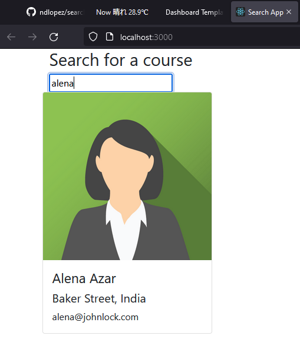

# YetAnother react Tutorial

Search for a user and display information

## Run

    $ npm install
    
    $ npm start

List NPM packages:  npm list -g --depth=0

## Environment

- OS: Windows 11 Pro
- nodejs: v16.14.2
- Editor: VS Code